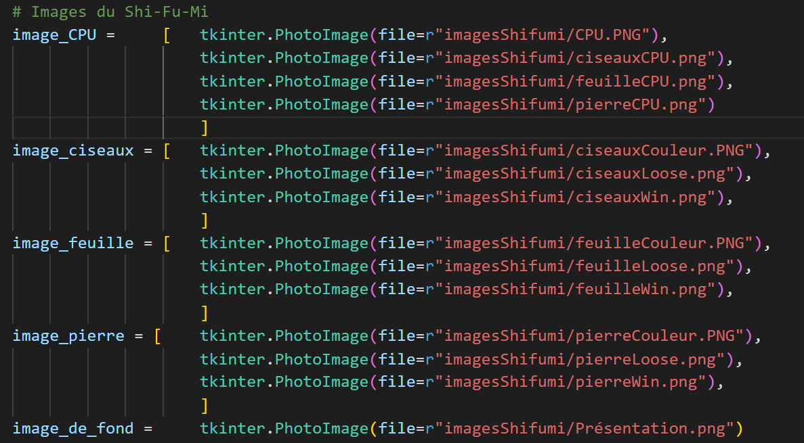
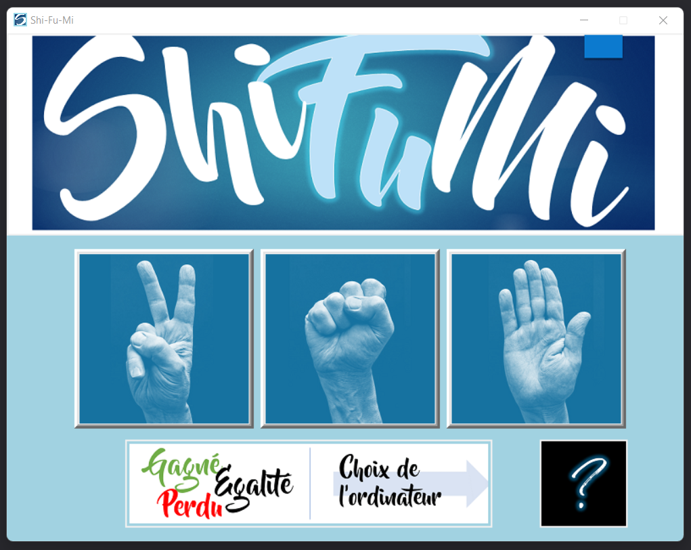
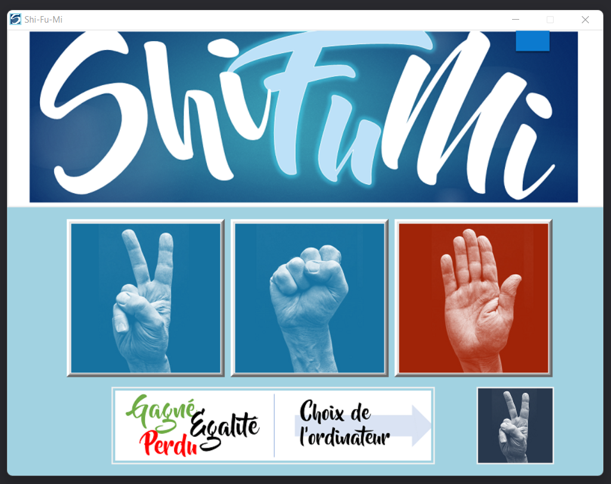
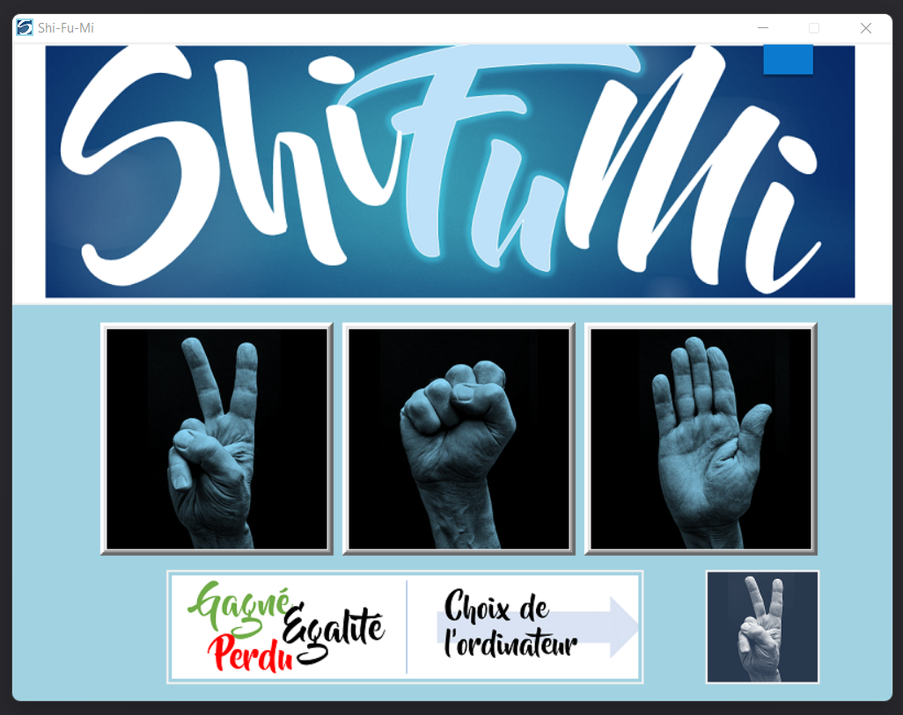
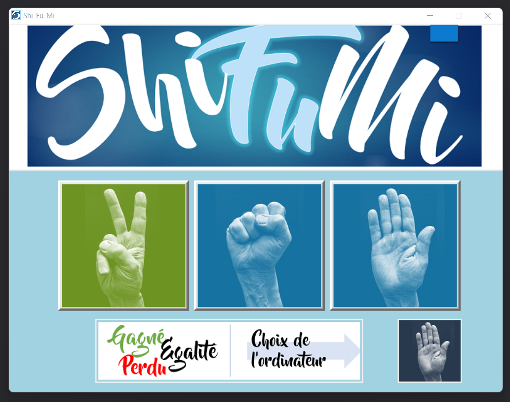
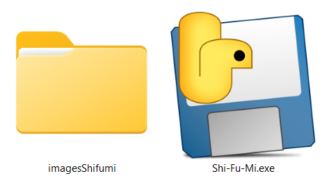

### Projet Shi-Fu-Mi

 

  

 

### Qu'est ce que Shi-Fu-Mi ?

Le chifoumi, est le jeu pierre-feuille-ciseaux, ce jeu est souvent utilisé comme projet de formation. Certains proposent des tutoriels en console pour mettre en pratique la logique du jeu. J'ai voulu ici présenter le jeu avec une interface graphique que j'ai réalisé avec powerpoint. 

 

  

 

### L'interface graphique

L'affichage se compose de trois boutons qui changent de couleurs en fonction du choix aléatoire de l'ordinateur.

Perdu :
 

  

 
Egalité :
 

  

 
Gagné :
 

  

 

### La version .EXE

Une fois le projet terminé j'ai converti le jeu en fichier executable, vous pouvez le retrouver dans le fichier qui porte le nom "Projet converti en EXE"

 

  

 

### Mes reseaux sociaux : 

   
    

            
            
             
            
            
            
            
            
    
  

